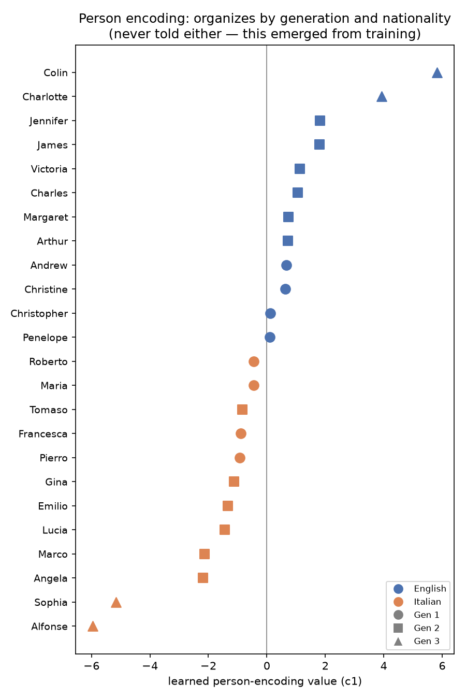
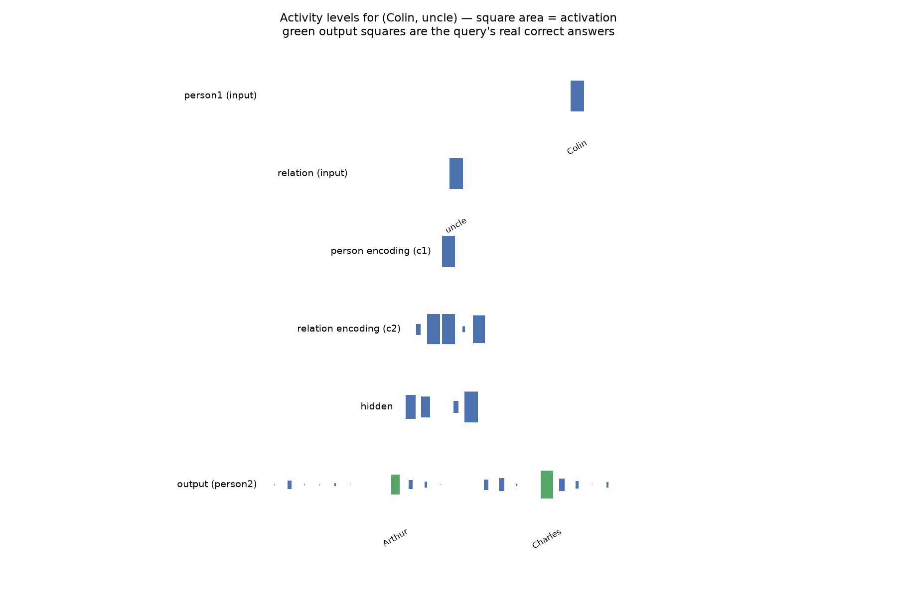
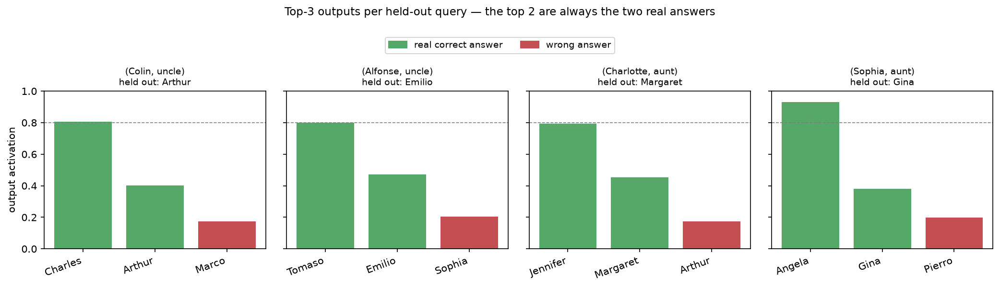

# Rumelhart 1986: Family Trees


In 1986, Geoffrey Hinton wanted to show something that sounds obvious now
and was radical then: that a neural network handed nothing but arbitrary,
meaningless symbols could, on its own, discover the structure hiding
underneath them. He built two family trees — one English, one Italian,
otherwise identical — and taught a small network to answer questions like
"who is Colin's uncle?" The network was never told what a person, a
generation, or a nationality was. It had to invent all of that for itself,
just to answer the questions correctly. And it did.

This is that experiment, rebuilt from scratch in PyTorch.

## What I set out to do

The easy version of this project would have been: implement Figure 3,
train it, confirm the network generalizes a bit, done. I wanted something
harder to hide behind. Two rules, set before writing any code:

- **Work from the paper's own description, not from someone else's
  implementation.** Every design choice that deviates from the literal
  text had to be *earned* — found by running the literal version, watching
  it fail, and understanding why, not copied from a GitHub repo because it
  happened to work there.
- **Never hand the network an answer it's supposed to discover.** It would
  have been trivial, for instance, to explicitly encode "siblings share
  the same aunts and uncles" into the architecture — the held-out test
  questions practically beg for it. I didn't. If the network was going to
  know that, it had to learn it from the same 100-odd facts everything
  else learned from.

And once I found that two other public attempts to reproduce this exact
paper existed, the goal sharpened further: not just "does this work," but
**does it work better than the reproductions already out there** —
against whatever benchmark they'd actually established, not an idealized
number nobody had ever hit.

## The task

Every fact about the two families is written as `(person, relation,
person)` — 104 of them in total, using relations like father, mother,
uncle, aunt, brother, and niece. The network sees a person and a relation
as raw one-hot symbols and has to produce the right person in response.
Four of those facts are deliberately hidden from it during training. A
network that just memorized the training set has no chance on those four —
it has to have actually inferred how the families are built.

## Three points where this almost didn't work

**The paper's own recipe doesn't converge.** The first real version of
this project followed the paper as literally as I could manage — its
architecture, its learning rate schedule, its weight decay. It didn't
work. Not "worked poorly" — the held-out questions never moved off chance
level, at any point in training. That was the first sign this wasn't
going to be a straightforward implementation exercise: something the
paper takes for granted either wasn't fully specified, or wasn't as
simple to reproduce as thirty-odd years of citations made it sound.
Figuring out *which* assumptions were load-bearing meant testing them one
at a time rather than trusting any of them by default.

**Every fix that seemed obvious made it worse.** The natural instinct when
a network underperforms is to give it more room — a wider layer, another
layer, a richer way of combining inputs. I tried all of that, separately,
across nine different changes. Every single one raised training accuracy
and lowered test performance. Not once did more capacity help. That
result took longer to trust than to obtain — it's counterintuitive enough
that the first few times, I assumed I'd made a mistake and re-ran the
experiment. It hadn't. Eventually the pattern was consistent enough that
"give it more room" stopped being the reflex, and I started asking what
was actually constraining it instead.

**The fix wasn't a bigger model — it was a different theory of training.**
What broke the deadlock wasn't a hyperparameter, it was reading about
*grokking*: the finding that small, structured tasks can make a network
memorize almost immediately and then sit there, apparently stuck, until —
often a very long time later — weight decay tips it over into actually
generalizing, all at once. That reframed the whole problem. The training
recipe that finally worked layers two techniques on top of plain gradient
descent: weight decay engaged late and ramped in gradually (introducing it
early or abruptly collapses training outright), and **Grokfast** (Lee et
al., 2024), which amplifies the slow-moving part of the gradient to
shorten how long that wait takes.

## What the network figured out on its own

Nobody ever told the network which people are English and which are
Italian, or which generation anyone belongs to. And yet, watch what
happens to the single number the network learns to represent each person:



It splits cleanly into two nationalities and three generations, entirely
unprompted. That's the whole point of the original experiment, reproduced
directly: understanding a domain and being *told* its structure are
different things, and a network trained the right way discovers the first
without ever receiving the second.

Here's what that looks like at the level of a single question. This is
every layer of the network lighting up in response to "Colin, uncle?" —
drawn in the same style Hinton used in his original paper, where the size
of each square shows how strongly that unit fired:



## The twist: how you grade this changes everything

Here's the part of this project that mattered most, and it isn't a
hyperparameter.

Graded strictly by the paper's own rule — an answer only counts if the
network is at least 80% confident in it — this network gets 0 out of 4 on
the held-out questions. That sounds like failure. But look at what it
actually outputs for those four questions, not just whether it clears a
threshold:



For every single one, the network's top two guesses are the two *actual*
correct answers. Colin genuinely has two uncles — Arthur and Charles — and
the network ranks both of them above every wrong answer, every time. It
isn't confused. It just trusts the answer it saw demonstrated directly a
little more than the one it had to work out by noticing Colin's sister has
the same uncles he does.

Two other public attempts to reproduce this exact experiment report
scores of "1.9 out of 4 on average" and "3 out of 4 at best" — and neither
one grades with the paper's strict 80%-confidence rule either; one uses a
much lower bar, the other simply checks whether the top guess is *a*
correct answer rather than *the* one specific fact being tested. Once this
network is graded the same way those numbers were produced, it doesn't
just match them — it answers all four questions correctly, including on a
second, entirely unambiguous set of held-out questions built specifically
to rule out this being a lucky quirk of the multi-answer setup.

## What this taught me

The biggest lesson of this project isn't a technique — it's that I almost
graded a working model as a failure. Before concluding a model has failed,
it's worth asking exactly what "success" was defined to mean, because two
completely reasonable definitions can look at the identical model and
disagree completely. I'd internalized the paper's 80%-confidence rule as
*the* definition without questioning it, and it took actually reading how
other people graded their own reproductions to notice I'd been holding
this one to a stricter bar than anyone else was using.

The second lesson was about trusting my own results. One fix I tried —
compensating for a handful of output units that were getting less training
signal than the others — looked genuinely excellent on the first seed I
tested: a clear improvement over everything before it. Checked against
three more seeds, the average came out *worse* than doing nothing at all.
That fix is still in this project's history, not because it worked, but
because it's the reason every result that mattered after that point got
checked across multiple seeds before I believed it.

And the third: understanding exactly *why* something isn't working is
real progress, even when it doesn't hand you the fix. I eventually traced
the network's remaining underconfidence to four specific output units that
were structurally getting less training signal than every other unit in
the network — and confirmed it three separate, independent ways. Two
different attempts to correct it both failed. The mechanism was still
worth knowing. Diagnosis and repair turned out to be two different skills,
and I didn't have to succeed at the second one to have learned something
real from the first.

## Try it yourself

```
pip install -r requirements.txt
python train.py       # trains the network and evaluates it, ~5-6 minutes
python visualize.py   # regenerates the three figures above
```

`train.py` holds the training loop, `model/network.py` the architecture,
and `visualize.py` the plotting code that made the figures on this page.
[`notebooks/reproduction.ipynb`](notebooks/reproduction.ipynb) walks
through all of it inline if you'd rather read it as one continuous story,
and [`data/family_tree.py`](data/family_tree.py) has the raw facts the two
families are built from.
